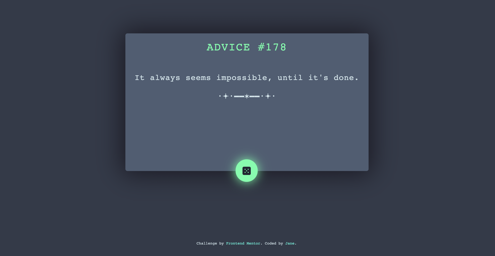

# Frontend Mentor - Advice generator app solution

This is a solution to the [Advice generator app challenge on Frontend Mentor](https://www.frontendmentor.io/challenges/advice-generator-app-QdUG-13db). Frontend Mentor challenges help you improve your coding skills by building realistic projects.

## Overview

### The challenge

Users should be able to:

- View the optimal layout for the app depending on their device's screen size
- See hover states for all interactive elements on the page
- Generate a new piece of advice by clicking the dice icon

### Screenshot

### Links

- Live Site URL: [Add live site URL here](https://jvmcpheron.github.io/advice-generator/)

## My process

### Built with

- Semantic HTML5 markup
- CSS
- Flexbox
- Mobile-first workflow
- Bootstrap
- JavaScript

### What I learned

One thing that this project really solidified is working with third-party APIs. I only had two other projects before this one using third-party APIs, and working on both of them was challenging, and my code was messy. But this third project has really helped me grasp the process and be comfortable accessing APIs.

### Useful resources

- [Bootstrap](https://getbootstrap.com/docs/5.2/getting-started/introduction/) - This is the Bootstrap documentation. It helped me with the majority of my styling, and helped me style the page quickly and efficiently.

## Author

- Website - [Jane](https://jvmcpheron.github.io/Bootstrap_Portfolio)
- Frontend Mentor - [@jvmcpheron](https://www.frontendmentor.io/profile/jvmcpheron)
- Github - [@jvmcpheron](https://github.com/jvmcpheron)

## Acknowledgments

Worked on this with a friend of mine named Hunter. His Github: https://github.com/HunterMcGrew 